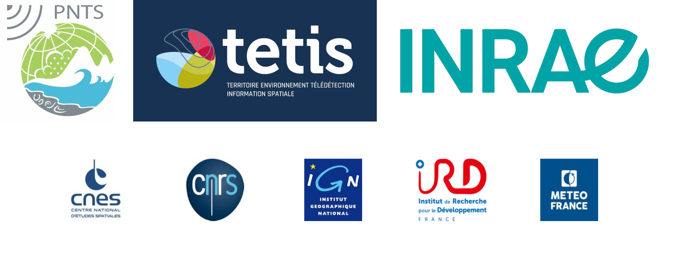
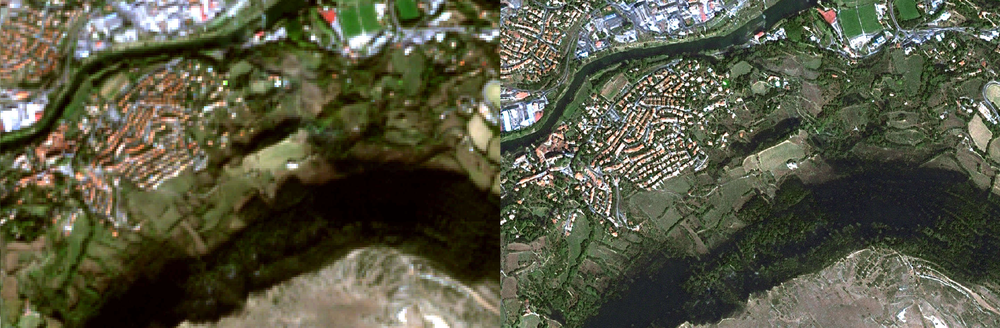
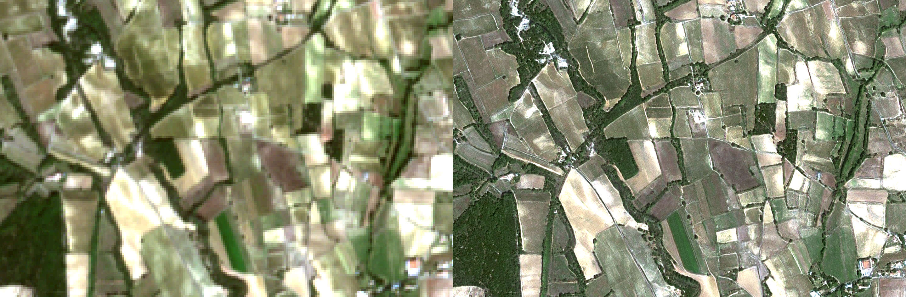

# SR4RS

An open source tool for super resolution.
You can add your own models, cost functions, feel free to open a PR!

## Cite

http://doi.org/10.5334/jors.369

```
@article{cresson2022sr4rs,
  title={SR4RS: A Tool for Super Resolution of Remote Sensing Images},
  author={Cresson, R{\'e}mi},
  journal={Journal of Open Research Software},
  volume={10},
  number={1},
  year={2022},
  publisher={Ubiquity Press}
}
```

## Super Resolution for Remote Sensing

This work has been supported by the Programme National de Télédétection Spatiale ([PNTS](http://programmes.insu.cnrs.fr/pnts/)), grant n° PNTS-2020-07 



## Representative images

The following are Sentinel-2 images processed with a model trained from pansharpened Spot-6/7 images.




[Look at the entire Sentinel-2 image processed over the Montpellier area](https://remicres.github.io/super-resolution) (Image is resampled in another cartographic projection, which might distord a bit the nice result!).

## Read more

Blog post on [MDL4EO](https://mdl4eo.irstea.fr/2019/03/29/enhancement-of-sentinel-2-images-at-1-5m/)

## How to use?

SR4RS needs **OTBTF>=2.3** to work.

### Quick HR image generation using pre-trained model

1. Get the latest OTBTF docker image and enter the docker image.  Here is an example with the otbtf 2.5 gpu image, using NVIDIA runtime:
```
docker run -ti --runtime=nvidia mdl4eo/otbtf:3.4.0-gpu bash
```

2. Download and unzip a pre-trained SavedModel (see [this section](doc/PRETRAINED_MODELS.md) to see available pre-trained models)
```
wget https://nextcloud.inrae.fr/s/boabW9yCjdpLPGX/download/sr4rs_sentinel2_bands4328_france2020_savedmodel.zip
unzip sr4rs_sentinel2_bands4328_france2020_savedmodel.zip
```

3. Clone SR4RS
```
git clone https://github.com/remicres/sr4rs.git
```

4. Use SR4RS to create an HR image (the considered pre-trained model runs on a Sentinel-2 image, 4-channels ordered as Red, Green, Blue, Near infrared). Just download a Sentinel-2 image from ESA hub or elsewhere, then concatenate the bands in this order (for that you can use the OTB application named `otbcli_ConcatenateImages`).
```
python sr4rs/code/sr.py \
--savedmodel sr4rs_sentinel2_bands4328_france2020_savedmodel \
--input /path/to/some/S2_image/stacked_channels_4328_10m.tif \
--output test.tif
```

### Train a model

Here is a summary of the steps to follow.
1. Generate patches images using the `PatchesExtraction` application from OTBTF, from one low-res image (LR) and one high-res image (HR)
2. Run `train.py` on your patches images, and generate a SavedModel
3. Use `sr.py` on LR image using the previously generated SavedModel

For more details, see the [documentation](doc/HOW_TO.md) and check the [pre-trained models](doc/PRETRAINED_MODELS.md).
